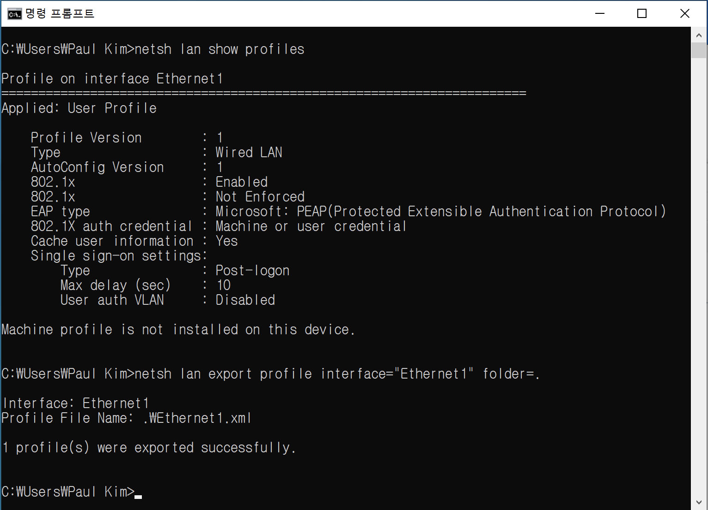
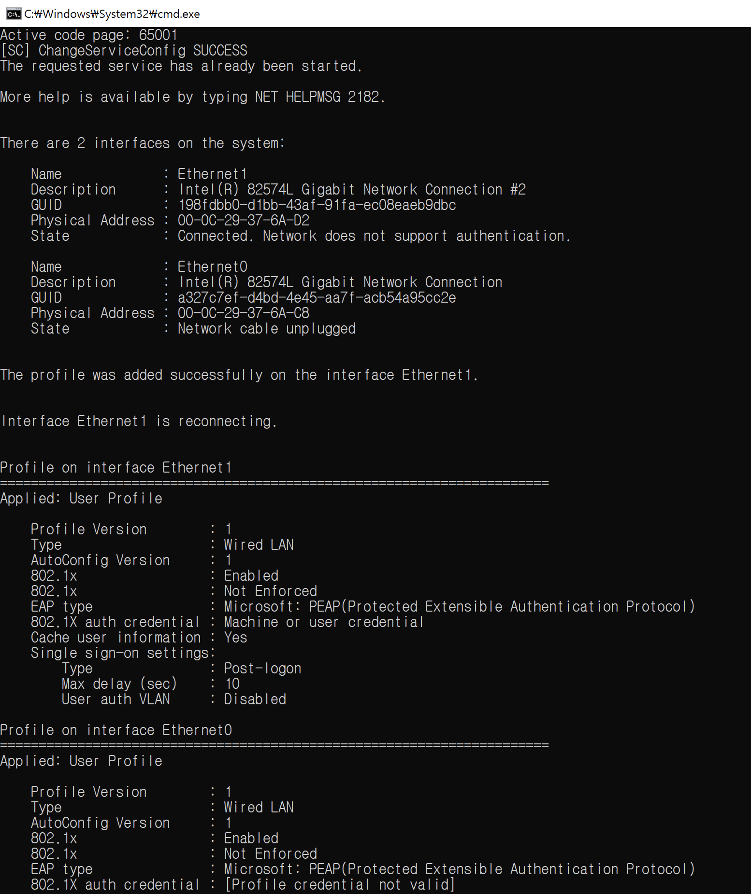

# SmartConnect_wired_for_windows

### Description
To use wired 802.1x authentication in Windows, you must add a profile.
(in the past, I used to use quickconnect. but now, quickconnect is EoS)

Customers want to add profile for wired authentication easily.

So I created windows batch file for adding wired profile
Just double-click SmartConnect_wired_for_windows.bat to add wired profile for Windows

### Scenarios

1. Requesting administrative privileges 
this batch program works by prompting you for permission when a task requires administrative rights

2. Start Wired AutoConfig (DOT3SVC) Service 
wired 802.1x should need to DOT3SVC Wired AutoConfig (DOT3SVC) Service

3. Check connected interface to ethernet adapter 

4. Add profile to connected interface

5. Reconnect interface for 802.1x retry

### How to run

1. download SmartConnect_Wired_for_Windows 

https://github.com/aruba-paulkim/SmartConnect_wired_for_windows

2. Setup your own profile in your PC and export profile xml.

To export your profile, use the following command:
<pre>netsh lan show profiles
netsh lan export profile interface="Ethernet1" folder=.
</pre>

3. change your profile file name to Ethernet.xml

4. move to SmartConnect_Wired_for_Windows folder.

5. run or double-click SmartConnect_wired_for_windows.bat file

6. check result

